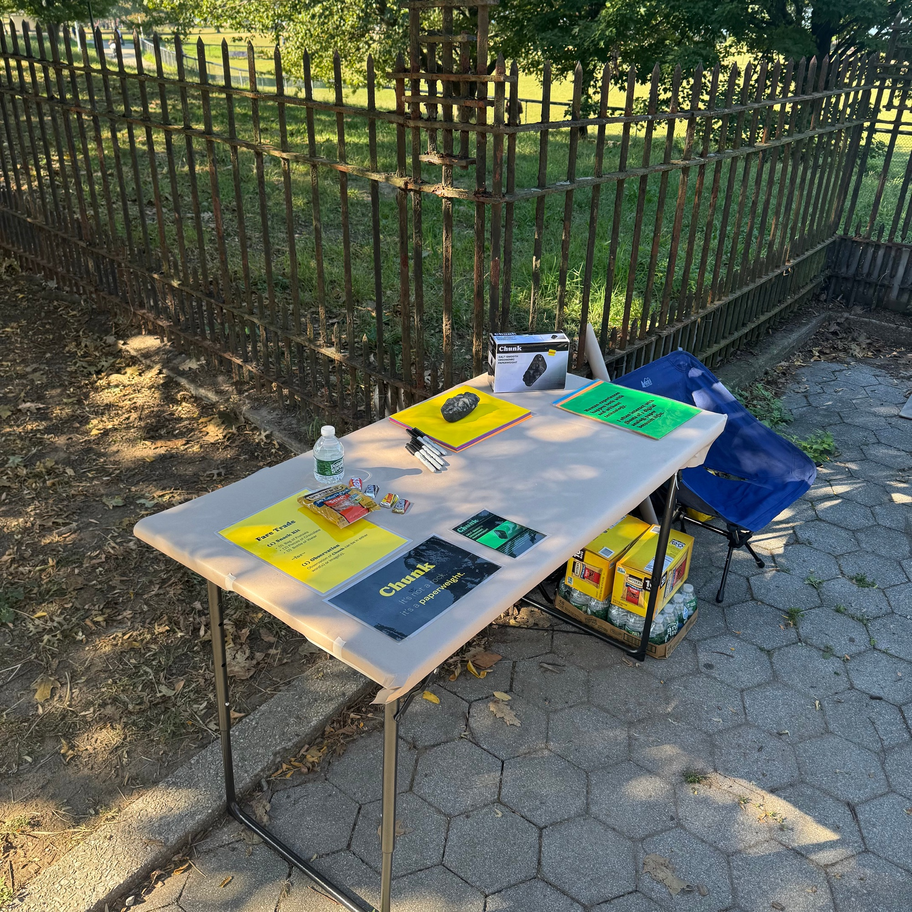

# Chunk: A Dada Manifesto

**Phil Cote**

---

## The Goal

**Write a manifesto and choose typography which expresses those writings in a holistic way.**

---

## The Look, Feel, & Attitude

**After researching various art & design manifestos, I landed on Dada and The Why Cheap Art? Manifesto; evoking a sense of nonsensical craft.**

> [IMAGE] Two reference documents side by side on a green background:
> - Left: *the WHY CHEAP ART? manifesto* — Bread & Puppet Glover, Vermont, 1984. Full text reads:
>   "PEOPLE have been THINKING too long that ART is a PRIVILEGE of the MUSEUMS & the RICH. ART IS NOT BUSINESS! It does not belong to banks & fancy investors. ART IS FOOD. You cant EAT it BUT it FEEDS you. ART has to be CHEAP & available to EVERYBODY. It needs to be EVERYWHERE because it is the INSIDE of the WORLD. **ART SOOTHES PAIN!** Art wakes up sleepers! ART FIGHTS AGAINST WAR & STUPIDITY! **ART SINGS HALLELUJA!** ART IS FOR KITCHENS! **ART IS LIKE GOOD BREAD!** Art is like green trees! Art is like white clouds in blue sky! **ART IS CHEAP! HURRAÏ**"
> - Right: *MANIFESTE DADA 1918* — dense French text broadsheet

The typography and aesthetic of the Bread & Puppet poster helped to define how I would approach the making: cheap & visually rich; the attitude towards the work would be determined by the "Anti-Manifesto" Dadaists: contradictory, absurdist, non-sensical.

---

## The Writing

**Highlighting my preferences to art over design, and how I still grapple with where that line gets drawn in my work, I tried to make open-ended statements which could be interpreted in either direction.**

> [IMAGE] Photo of a wall display with colorful tile-printed panels clipped with binder clips, and a small book with a burn mark (pre-Chunk). The tile panels contain the nine manifesto statements (see below).

*Caption: The first two iterations: A book (with pre-Chunk burn mark), and a tile print.*

### Manifesto Text (from tile panels)

**Panel 1 — Red**
So many people are wondering the path forward?

Maybe the simplest answer is that we don't need the technology we've innovated towards.

Technofascists will continue to try to steer us in these directions so we are easier to control as a system.

**Panel 2 — Yellow**
In almost all ways, art is more human than design, how then, can design imbue the intrinsic qualities of art… the unknown, the magic, the singularity.

**Panel 3 — Green**
Human experiences happen both with and without technology.

I often interact with ghosts of a digital analog; paper becomes light.

**Panel 4 — Dark Green**
It is dangerous to hold on to the past as much as it is to try to predict the future.

**Panel 5 — Yellow**
While my activities are often enabled by tools, the end goal is not to use the tool.

**Panel 6 — Blue**
I want to build for local storage.

I want to make things cheap AND useful.

**Panel 7 — Purple**
I want to build for those that resist automation.

For those seeking deeper human connection; a break from the shallow reality, a filtered or customized feed, replaced with the wonder and fear of getting temporarily lost in the woods.

**Panel 8 — Teal/Green**
I want interactions that are a not-for-profit.

**A public park, a hidden path, a simple surprise.**

**Panel 9 — Orange**
I have no taste and every taste.

I do not care if it is "good" or "bad".

I only care if it is creative, kind, fair, chaotic, anarchistic, socialist, humane.

---

## Quote

> "They use the same tools - words, pictures, colors. The difference as you'll be seeing, as you'll be showing me, is how."

**— The Cheese Monkeys**

---

## Explorations

### What is it?

Does a manifesto even need to be made of words? Couldn't it just be a result of a sequence of deliberate actions (art)?

> [IMAGE] Three reference images on an orange background:
> - Left: Emerson Dual Alarm AM/FM Digital Clock Radio box (model AK2776)
> - Center: Art book open to a page showing legs of an umbrella sticking up from a blue trash can, with scattered debris
> - Right: A Robert Venturi collage study for Louis & London for MBC International (cut paper shapes resembling a figure)
> - Bottom right corner: A smooth grey rock/paperweight illustration

---

### Explorations (cont.)

**I tried a lot of different formats and interpretations of what a manifesto actually is, introducing the concept of "Manifesto as Product" with the Chunk Paperweight.**

**Meditations on this object now appended the original manifesto text.**

> [IMAGE] Photo of a studio wall installation showing: two large colorful dot-pattern prints labeled "noise" and "threads," a gray panel with sticky notes and the Chunk paperweight mounted on it, the colorful tile manifesto strip unrolling from the wall down to the floor, with the Chunk rock paperweight sitting at the end of the roll on the hardwood floor.

*Caption: Continuing to use art & design references which **inherently infuse and blur lines** between art and design (saying things vs solving problems).*

---

### Explorations (cont.)

**An invitation to possibly do nothing…**

**An invitation to possibly "go somewhere, do something"; taken straight from the dictionary definition of the word, leaving it open-ended and non-prescriptive, and most importantly, Dadaist.**

> [IMAGE] Photo of a corkboard with planning notes and finished Chunk materials:
> - Yellow sticky note with handwritten concept notes:
>   - "Sending a formal letter to 'go somewhere, do something'"
>   - "1. Go somewhere / 2. Do something"
>   - "2 buttons YES/NO 'the thing just changes' 'BOOLEAN KIOSK'"
>   - "request to someone"
>   - "Written request in the spirit of manifesta"
>   - "Install something in Bay Ridge — think about good hiding spots"
>   - "Sound/noise? Performance?"
>   - "Involvement in nature run off 9u"
>   - "'written Request' — 'inviteVibe' = ['polite' 'formal' 'friendly']"
> - Second yellow sticky: "WHO IS IT FOR? Anyone who is interested. WHY SHOULD THEY CARE? There is a 50/50 chance they aren't going to. WHAT IS THE INTENT? There is a 50/50 chance they do care, and they go somewhere, and do something."
> - Chunk formal letters/envelopes (grey paper stock, signed Philip Cote)
> - Chunk product packaging — black card reading "Chunk — SALT-SMOOTH ERGONOMIC PAPERWEIGHT"
> - Bottom row: Three vintage letterhead documents — *Liden Products (Whitewood) Ltd*, *Speedwell Lubricants*, *Robot Salesmen Ltd.*

---

### Explorations (cont.)

**An invitation to observe. An offering of snacks for thoughts. Leaving a breadcrumb trail to the destination…**

**Relying on foot traffic alone didn't get as much engagement as I had expected. The flyer also proved ineffective to inviting any participants.**

---

## Outcomes: What I Learned

### The less said, the better.

I removed more content than I had started with; of the original nine panels of the manifesto, these two statements felt universal enough to share when asked for meaning behind the work.

> [IMAGE] Two green panels on an orange background, plus a Chunk rock illustration with speech bubble reading "It's a rock."

**Panel A (dark green):**
Human experiences happen both with and without technology.

I often interact with ghosts of a digital analog; paper becomes light.

**Panel B (dark green):**
I want interactions that are not for profit.

**A public park, a hidden path, a simple surprise.**

---

## Outcomes: What I Got Out of It

### Inspiration to scale.

I started to see this less as a singular work and more as a jumping point for future work. In cycling through multiple variations of the work, I was able to arrive sooner at a concept which is exciting and has real audience participation. The iterative process also provided a much richer foundation for utilizing **AI-assisted image and content generation.**

> [IMAGE] AI-generated image of a "Chunk" market booth — a large grey pop-up tent branded "Chunk / Objects for Stillness," with a table draped in black "Chunk — It's not a paperweight." cloth, colorful manifesto panels on the tent walls, and a feather banner reading "Chunk / It's not a rock, it's a paperweight."

*Caption: Some hallucinations as Dadaist AI offerings for future poster designs: **"Fown follows, funeten. And to snove fast."***

---

## Outcomes: What My Audience Got

### Pleasantly surprised.

Despite the range of reactions I think the audience was generally pleased with the scene even some of those who didn't engage. For those who did participate, I observed them taking an opportunity to do something different with their day, which appeared to have a positive effect overall.

> [IMAGE] Chunk rock illustration with speech bubble reading "Life. Death. Rock."
